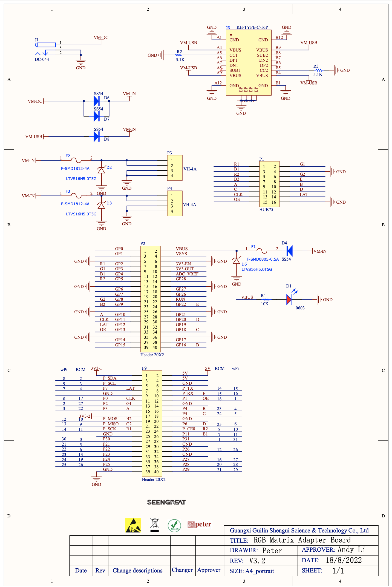

# RPI-PICO-RGB-MATRIX

- [Config with RPI PICO](https://seengreat.com/wiki/74/rgb-matrix-p3-0-64x64?srsltid=AfmBOoogWroGGkezKm0HI9M8vRsy7f2RtWwSRmi7EWhUHALqkg1_0GIL#toc8)
- [Python Examples](https://github.com/seengreat/RGB-Matrix-P3.0-64x64/blob/main/README.md)
- [RGB Adaptor Board](https://seengreat.com/product/194/rgb-matrix-adapter-board?srsltid=AfmBOoo26Qq1lkXC0AHAF_p4dEjAFspJBpO3KBZvkm98asGCh5zYnHtw)
- [RGB Adaptor Board - wiki](https://seengreat.com/wiki/75/rgb-matrix-adapter-board)
- [RGB Display 64x64 - wiki](https://seengreat.com/wiki/74/rgb-matrix-p3-0-64x64)

# Usage
- [Pin Definitions](https://seengreat.com/wiki/75/rgb-matrix-adapter-board#toc3)

By examination of the pin definitions, we see

# RGB Adapter Board

Schematic

